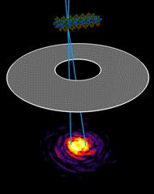

  |  
:-------------------------:|:-------------------------:
4D-STEM Experiment  |  Data Analysis

**py4DSTEM** is an open source set of python tools for processing and analysis of four-dimensional scanning transmission electron microscopy (4D-STEM) data.

# py4DSTEM_Tutorials

This repository contains tutorials for the py4DSTEM Python package.  For more information about py4DSTEM, including installation instructions, see https://github.com/py4dstem/py4DSTEM.

